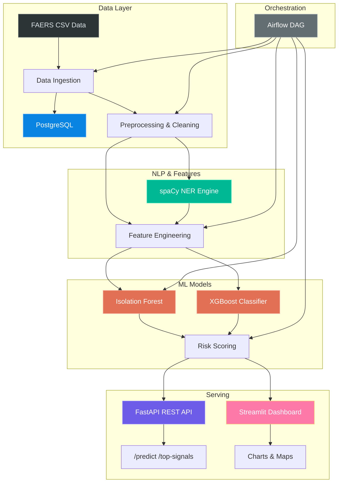

<p align="center">
  <h1 align="center">🛡️ AI Pharmacovigilance Intelligence Platform</h1>
  <p align="center">
    <strong>Production-grade drug safety signal detection powered by Machine Learning & NLP</strong>
  </p>
  <p align="center">
    
    
    
    
    
    
    
    
  </p>
</p>

---

## 📋 Overview

An end-to-end AI platform that **detects potential drug safety signals** from adverse event reports, modeled on the FDA FAERS (FDA Adverse Event Reporting System) dataset. The system ingests adverse event reports, cleans and preprocesses data, extracts entities via NLP, engineers pharmacovigilance features, trains ML models for signal detection, and serves results through a REST API and interactive dashboard.

**Designed for** pharmacovigilance teams, regulatory bodies, and pharmaceutical companies that need automated, scalable drug safety surveillance.

---

## 🏗️ Architecture



---

## 📁 Project Structure

```
├── README.md
├── requirements.txt
├── Dockerfile
├── docker-compose.yml
├── Makefile
├── .gitignore
│
├── configs/
│   └── config.yaml                  # Central configuration
│
├── data/
│   ├── raw/                         # Raw FAERS CSVs
│   └── processed/                   # Cleaned data & features
│
├── notebooks/                       # Exploration notebooks
│
├── src/
│   ├── ingestion/
│   │   └── data_loader.py           # CSV → DataFrame → PostgreSQL
│   ├── preprocessing/
│   │   └── clean_data.py            # Missing values, normalization
│   ├── nlp/
│   │   └── entity_extraction.py     # spaCy NER for drugs/events/severity
│   ├── features/
│   │   └── feature_engineering.py   # PRR, ROR, co-occurrence, trends
│   ├── models/
│   │   ├── train_model.py           # Isolation Forest + XGBoost pipeline
│   │   └── predict.py               # Inference & scoring
│   ├── pipelines/
│   │   └── etl_pipeline.py          # Airflow DAG
│   ├── database/
│   │   └── db.py                    # SQLAlchemy ORM models
│   ├── api/
│   │   └── app.py                   # FastAPI service
│   └── utils/
│       └── helpers.py               # Config, logging, normalization
│
├── dashboard/
│   └── streamlit_app.py             # Interactive visualization
│
├── tests/
│   ├── conftest.py                  # Shared fixtures
│   ├── test_models.py               # Pipeline & model tests
│   └── test_api.py                  # API endpoint tests
│
├── scripts/
│   ├── generate_faers_data.py       # Synthetic dataset generator
│   ├── run_training.sh
│   └── run_pipeline.sh
│
└── .github/workflows/
    └── ci.yml                       # GitHub Actions CI
```

---

## 🚀 Quick Start

### Prerequisites

- Python 3.11+
- PostgreSQL 16 (optional — only needed for DB features)
- Docker & Docker Compose (optional)

### 1. Install Dependencies

```bash
pip install -r requirements.txt
python -m spacy download en_core_web_sm
```

### 2. Generate Synthetic Data

```bash
python scripts/generate_faers_data.py
```

This creates `data/raw/adverse_events.csv` with ~10,000 realistic adverse event reports.

### 3. Train the Model

```bash
python -m src.models.train_model
```

Outputs:
- `models/isolation_forest.joblib`
- `models/xgboost_classifier.joblib`
- `data/processed/signal_scores.csv`

### 4. Start the API

```bash
uvicorn src.api.app:app --host 0.0.0.0 --port 8000 --reload
```

### 5. Launch the Dashboard

```bash
streamlit run dashboard/streamlit_app.py
```

### 6. Run Tests

```bash
python -m pytest tests/ -v
```

---

## 🐳 Docker

```bash
# Build and run all services
docker-compose up --build -d

# Services:
#   API        → http://localhost:8000
#   Dashboard  → http://localhost:8501
#   Airflow    → http://localhost:8080
#   PostgreSQL → localhost:5432
```

---

## 📊 Dataset

The platform uses the **FDA FAERS** (FDA Adverse Event Reporting System) schema. A built-in synthetic data generator creates realistic reports with:

| Field | Description |
|-------|-------------|
| `report_id` | Unique identifier |
| `patient_age` | Age in years |
| `patient_sex` | Male / Female |
| `drug_name` | 50 common drugs |
| `adverse_event` | 50 adverse events |
| `severity` | mild / moderate / severe / life-threatening |
| `outcome` | recovered / not recovered / fatal / unknown |
| `report_date` | 2018–2025 range |
| `country` | 22 countries |
| `narrative` | Free-text clinical description |

The generator includes **biased drug-event mappings** (e.g., warfarin → thrombocytopenia) so the ML model can discover real safety signals.

---

## 🔌 API Reference

### `POST /predict`

Score a drug-event pair.

```bash
curl -X POST http://localhost:8000/predict \
  -H "Content-Type: application/json" \
  -d '{"drug_name": "warfarin", "adverse_event": "thrombocytopenia"}'
```

**Response:**
```json
{
  "drug_name": "warfarin",
  "adverse_event": "thrombocytopenia",
  "risk_score": 0.8723,
  "signal_strength": 0.9104,
  "alert_level": "critical"
}
```

### `GET /top-signals?n=10`

Return the N highest-risk drug-event pairs.

```bash
curl http://localhost:8000/top-signals?n=5
```

### `GET /health`

Liveness probe.

### `GET /stats`

Dataset summary statistics.

### Interactive Docs

Visit `http://localhost:8000/docs` for the Swagger UI.

---

## 📈 Dashboard

The Streamlit dashboard provides five views:

| Page | Content |
|------|---------|
| 📊 Overview | KPIs, alert distribution pie chart, top 10 riskiest pairs |
| 💊 Top Risky Drugs | Horizontal bar chart ranked by average risk score |
| ⚠️ Adverse Events | Most frequent events with risk score overlay |
| 📈 Risk Trends | Monthly report volume and per-drug trend lines |
| 🌍 Geographic | Choropleth map of reports by country |

---

## 🧪 Testing

```bash
# Run all tests
python -m pytest tests/ -v

# Run only model tests
python -m pytest tests/test_models.py -v

# Run only API tests
python -m pytest tests/test_api.py -v
```

Tests cover:
- ✅ Data preprocessing (missing values, normalization, standardization)
- ✅ Feature engineering (PRR, ROR, shapes, constraints)
- ✅ Model training (score ranges, alert level validity)
- ✅ Prediction inference (cache lookup, model scoring)
- ✅ API endpoints (health, predict, top-signals, stats, validation errors)

---

## ⚙️ Configuration

All settings are in `configs/config.yaml`. Environment variables override defaults:

| Variable | Default | Description |
|----------|---------|-------------|
| `DB_HOST` | localhost | PostgreSQL host |
| `DB_PORT` | 5432 | PostgreSQL port |
| `DB_NAME` | pharmacovigilance | Database name |
| `DB_USER` | pharma_user | Database user |
| `DB_PASSWORD` | pharma_pass | Database password |

---

## 📄 License

MIT License — see [LICENSE](LICENSE) for details.

---

<p align="center">
  <sub>Built with ❤️ for safer pharmaceuticals</sub>
</p>
